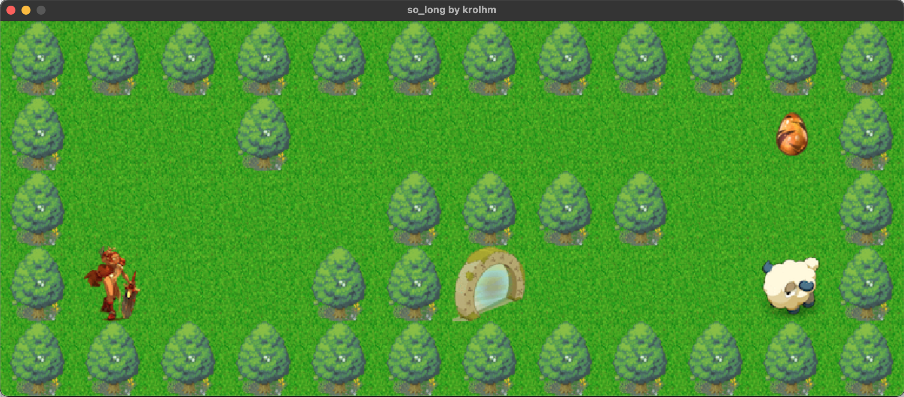

# so_long 🐬 
## **Mac** & **Linux** !

## Bonus
• Movement count is directly displayed on the screen instead of shell output.
• enemy patrols that cause the player to lose in case of contact.

## Good Links
🔗 https://eastmanreference.com/complete-list-of-applescript-key-codes